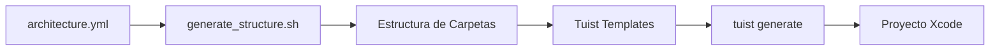

# 📱 Instagram Clone - SwiftUI + MVVM Architecture


Un clon completo de Instagram desarrollado en SwiftUI utilizando arquitectura MVVM limpia y escalable. Este proyecto demuestra las mejores prácticas en desarrollo iOS moderno, incluyendo generación automatizada de proyectos con Tuist y gestión de arquitectura mediante archivos YAML.

---

## 📋 Tabla de Contenidos

- [Características](#-características)
- [Arquitectura](#-arquitectura)
- [Requisitos](#-requisitos)
- [Instalación](#-instalación)
- [Estructura del Proyecto](#-estructura-del-proyecto)
- [Generación del Proyecto](#-generación-del-proyecto)
- [Configuración YAML](#-configuración-yaml)
- [Templates de Tuist](#-templates-de-tuist)
- [Uso](#-uso)
- [Roadmap](#-roadmap)
- [Contribución](#-contribución)
- [Licencia](#-licencia)

---

## ✨ Características

- ✅ **Autenticación** - Login y registro de usuarios
- ✅ **Feed de Posts** - Infinite scroll con imágenes y videos
- ✅ **Búsqueda y Exploración** - Encuentra usuarios y contenido
- ✅ **Crear Posts** - Captura fotos o selecciona de la galería
- ✅ **Stories** - Contenido temporal de 24 horas
- ✅ **Perfiles** - Visualización y edición de perfiles
- ✅ **Notificaciones** - Sistema de actividad en tiempo real
- ✅ **Likes y Comentarios** - Interacción social completa

---

## 🏗️ Arquitectura

### MVVM (Model-View-ViewModel)

Este proyecto implementa una arquitectura MVVM limpia con las siguientes capas:

```
┌─────────────────────────────────────────┐
│            SwiftUI Views                │
│         (Presentation Layer)            │
└──────────────┬──────────────────────────┘
               │
               ▼
┌─────────────────────────────────────────┐
│           ViewModels                    │
│      (Business Logic Layer)             │
└──────────────┬──────────────────────────┘
               │
               ▼
┌─────────────────────────────────────────┐
│            Services                     │
│       (Data Access Layer)               │
└──────────────┬──────────────────────────┘
               │
               ▼
┌─────────────────────────────────────────┐
│        Models + Networking              │
│         (Data Layer)                    │
└─────────────────────────────────────────┘
```

### Principios de Diseño

- **Separation of Concerns**: Cada capa tiene responsabilidades claras
- **Dependency Injection**: Facilita testing y modularidad
- **Coordinator Pattern**: Gestión centralizada de navegación
- **Protocol-Oriented**: Interfaces claras y testables
- **Reactive Programming**: Combine para flujo de datos reactivo

---

## 📦 Requisitos

### Herramientas Necesarias

| Herramienta | Versión | Propósito |
|------------|---------|-----------|
| **Xcode** | 15.0+ | IDE de desarrollo |
| **Swift** | 5.9+ | Lenguaje de programación |
| **Tuist** | 4.0+ | Generación y gestión de proyectos |
| **yq** | 4.0+ | Procesamiento de archivos YAML |
| **Git** | 2.0+ | Control de versiones |

### Instalación de Dependencias

```bash
# Instalar Tuist
curl -Ls https://install.tuist.io | bash

# Instalar yq (macOS)
brew install yq

# Verificar instalaciones
tuist version
yq --version
```

---

## 🚀 Instalación

### 1. Clonar el Repositorio

```bash
git clone https://github.com/tu-usuario/instagram-clone.git
cd instagram-clone
```

### 2. Configurar la Arquitectura

El proyecto utiliza un archivo YAML para definir la estructura de directorios:

```bash
# El archivo architecture.yml define toda la estructura
cat architecture.yml
```

**Ejemplo de `architecture.yml`:**

```yaml
project_name: InstagramClone

structure:
  - App:
      - InstagramCloneApp.swift
      - AppCoordinator.swift

  - Core:
      - Networking:
          - NetworkManager.swift
          - APIEndpoint.swift
          - HTTPMethod.swift
          - NetworkError.swift
      - Storage:
          - UserDefaultsManager.swift
          - KeychainManager.swift
          - PersistenceController.swift
      - Extensions:
          - View+Extensions.swift
          - Color+Extensions.swift
      - Utilities:
          - Constants.swift
          - ImageCache.swift

  - Models:
      - User.swift
      - Post.swift
      - Comment.swift
      - Story.swift

  - Features:
      - Authentication:
          - ViewModels:
              - LoginViewModel.swift
              - RegisterViewModel.swift
          - Views:
              - LoginView.swift
              - RegisterView.swift
          - AuthCoordinator.swift

      - Feed:
          - ViewModels:
              - FeedViewModel.swift
          - Views:
              - FeedView.swift
          - FeedCoordinator.swift

  - Services:
      - AuthenticationService.swift
      - PostService.swift
      - UserService.swift

  - Shared:
      - Components:
          - CustomButton.swift
          - CustomTextField.swift
      - Views:
          - LoadingView.swift
          - ErrorView.swift

  - Navigation:
      - Router.swift
      - NavigationState.swift

  - Resources:
      - Assets.xcassets:
      - Fonts:
```

### 3. Generar la Estructura de Carpetas

Ejecuta el script que lee el archivo YAML y crea todos los directorios:

```bash
# Dar permisos de ejecución
chmod +x scripts/generate_structure.sh

# Generar estructura desde YAML
./scripts/generate_structure.sh architecture.yml
```

Este script utiliza `yq` para parsear el YAML y crear automáticamente toda la jerarquía de carpetas y archivos.

### 4. Generar el Proyecto con Tuist

```bash
# Instalar dependencias de Tuist (si las hay)
tuist install

# Generar el proyecto Xcode
tuist generate
```

### 5. Abrir en Xcode

```bash
open InstagramClone.xcworkspace
```

---

## 📁 Estructura del Proyecto

```
InstagramClone/
├── App/                          # Configuración de la aplicación
│   ├── InstagramCloneApp.swift   # Entry point
│   └── AppCoordinator.swift      # Coordinador principal
│
├── Core/                         # Funcionalidades base
│   ├── Networking/               # Capa de red
│   ├── Storage/                  # Persistencia de datos
│   ├── Extensions/               # Extensiones de Swift/SwiftUI
│   └── Utilities/                # Helpers y utilidades
│
├── Models/                       # Modelos de datos
│   ├── User.swift
│   ├── Post.swift
│   └── ...
│
├── Features/                     # Módulos por funcionalidad
│   ├── Authentication/
│   │   ├── ViewModels/
│   │   ├── Views/
│   │   └── AuthCoordinator.swift
│   ├── Feed/
│   ├── Search/
│   ├── Profile/
│   └── Stories/
│
├── Services/                     # Servicios de negocio
│   ├── AuthenticationService.swift
│   ├── PostService.swift
│   └── ...
│
├── Shared/                       # Componentes compartidos
│   ├── Views/
│   ├── Components/
│   ├── Modifiers/
│   └── Protocols/
│
├── Navigation/                   # Sistema de navegación
│   ├── Router.swift
│   └── NavigationState.swift
│
├── Resources/                    # Recursos del proyecto
│   ├── Assets.xcassets/
│   └── Fonts/
│
├── Tuist/                        # Configuración de Tuist
│   ├── Config.swift
│   ├── Dependencies.swift
│   └── Templates/
│
├── scripts/                      # Scripts de automatización
│   └── generate_structure.sh
│
├── architecture.yml              # Definición de arquitectura
├── Project.swift                 # Configuración del proyecto Tuist
└── README.md
```

---

## 🔧 Generación del Proyecto

### Workflow Completo



### Paso a Paso Detallado

#### 1. **Definir Arquitectura en YAML**

Crea o modifica `architecture.yml` con la estructura deseada:

```yaml
project_name: MiApp

structure:
  - MiModulo:
      - ViewModels:
          - MiViewModel.swift
      - Views:
          - MiView.swift
```

#### 2. **Generar Estructura con Script**

El script `generate_structure.sh` procesa el YAML:

```bash
#!/bin/bash

# Script que usa yq para leer el YAML y crear carpetas
YAML_FILE=$1

# Extraer nombre del proyecto
PROJECT_NAME=$(yq '.project_name' $YAML_FILE)

# Crear estructura recursivamente
yq -r '.structure[] | to_entries[] | .key' $YAML_FILE | while read folder; do
    mkdir -p "$folder"
    echo "✓ Creado: $folder"
done

echo "✅ Estructura generada exitosamente"
```

Ejecutar:
```bash
./scripts/generate_structure.sh architecture.yml
```

#### 3. **Configurar Tuist**

**`Project.swift`:**

```swift
import ProjectDescription

let project = Project(
    name: "InstagramClone",
    targets: [
        Target(
            name: "InstagramClone",
            platform: .iOS,
            product: .app,
            bundleId: "com.tuapp.instagramclone",
            deploymentTarget: .iOS(targetVersion: "16.0", devices: [.iphone]),
            infoPlist: .default,
            sources: ["Sources/**"],
            resources: ["Resources/**"],
            dependencies: []
        )
    ]
)
```

#### 4. **Usar Templates de Tuist (Opcional)**

```bash
# Crear template personalizado
tuist edit

# Scaffold desde template
tuist scaffold mvvm-feature --name Profile
```

#### 5. **Generar Proyecto**

```bash
tuist generate
```

Esto creará:
- `InstagramClone.xcodeproj`
- `InstagramClone.xcworkspace`
- Configuraciones de schemes

---

## ⚙️ Configuración YAML

### Sintaxis y Convenciones

```yaml
project_name: NombreDelProyecto  # Nombre del proyecto

structure:
  - Carpeta:                      # Carpeta principal
      - Subcarpeta:               # Subcarpeta
          - Archivo.swift         # Archivo Swift
      - OtroArchivo.swift         # Archivo en carpeta principal
  
  - OtraCarpeta:
      - archivo.swift
```

### Ejemplo Completo de Feature

```yaml
structure:
  - Features:
      - Profile:
          - ViewModels:
              - ProfileViewModel.swift
              - EditProfileViewModel.swift
          - Views:
              - ProfileView.swift
              - Components:
                  - ProfileHeaderView.swift
                  - ProfileStatsView.swift
          - ProfileCoordinator.swift
```

### Ventajas del Enfoque YAML

✅ **Declarativo**: Define estructura de forma clara
✅ **Versionable**: Cambios rastreables en Git
✅ **Reproducible**: Misma estructura en cualquier máquina
✅ **Documentación**: Sirve como referencia del proyecto
✅ **Automatizable**: Fácil de procesar con scripts

---

## 🎨 Templates de Tuist

### Estructura de Templates

```
Tuist/Templates/
└── mvvm-feature/
    ├── mvvm-feature.swift        # Definición del template
    └── Templates/
        ├── ViewModel.stencil     # Template de ViewModel
        ├── View.stencil          # Template de View
        └── Coordinator.stencil   # Template de Coordinator
```

### Ejemplo de Template

**`mvvm-feature.swift`:**

```swift
import ProjectDescription

let nameAttribute: Template.Attribute = .required("name")

let template = Template(
    description: "MVVM Feature Template",
    attributes: [nameAttribute],
    items: [
        .file(
            path: "Features/\(nameAttribute)/ViewModels/\(nameAttribute)ViewModel.swift",
            templatePath: "ViewModel.stencil",
            context: ["fileName": "\(nameAttribute)ViewModel.swift"]
        ),
        .file(
            path: "Features/\(nameAttribute)/Views/\(nameAttribute)View.swift",
            templatePath: "View.stencil",
            context: ["fileName": "\(nameAttribute)View.swift"]
        )
    ]
)
```

**`ViewModel.stencil`:**

```swift
// {{ fileName }}
// {{ name }}
// Generated by Tuist

import Foundation
import Combine

final class {{ name }}ViewModel: ObservableObject {
    // MARK: - Published Properties
    @Published var isLoading = false
    @Published var error: Error?
    
    // MARK: - Initialization
    init() {
        // Setup
    }
    
    // MARK: - Methods
    func loadData() {
        // Implementation
    }
}
```

### Usar Template

```bash
tuist scaffold mvvm-feature --name Profile
```

---

## 💻 Uso

### Ejecutar la Aplicación

```bash
# Abrir proyecto
tuist generate
open InstagramClone.xcworkspace

# O directamente
tuist run
```

### Agregar Nueva Feature

1. **Actualizar `architecture.yml`:**

```yaml
  - Features:
      - NuevaFeature:
          - ViewModels:
              - NuevaFeatureViewModel.swift
          - Views:
              - NuevaFeatureView.swift
```

2. **Regenerar estructura:**

```bash
./scripts/generate_structure.sh architecture.yml
```

3. **Implementar código en los archivos creados**

### Testing

```bash
# Ejecutar tests
tuist test

# Con coverage
tuist test --coverage
```

---

## 🗺️ Roadmap

- [ ] Integración con Firebase
- [ ] Implementación de mensajería directa
- [ ] Reels y videos cortos
- [ ] Filtros de cámara en tiempo real
- [ ] Modo oscuro personalizado
- [ ] Internacionalización completa
- [ ] Tests unitarios (80%+ coverage)
- [ ] Tests de UI con Snapshot Testing
- [ ] CI/CD con GitHub Actions
- [ ] Documentación completa con DocC

---

## 🤝 Contribución

Las contribuciones son bienvenidas. Por favor:

1. Fork el proyecto
2. Crea una rama para tu feature (`git checkout -b feature/AmazingFeature`)
3. Commit tus cambios (`git commit -m 'Add some AmazingFeature'`)
4. Push a la rama (`git push origin feature/AmazingFeature`)
5. Abre un Pull Request

### Guías de Contribución

- Sigue la arquitectura MVVM establecida
- Actualiza `architecture.yml` si agregas nuevos módulos
- Incluye tests para nueva funcionalidad
- Documenta código público con comentarios
- Usa SwiftLint para mantener estilo consistente

---

## 📝 Licencia

Este proyecto está bajo la Licencia MIT. Ver el archivo `LICENSE` para más detalles.

---

## 👥 Autores

- **Tu Nombre** - *Desarrollo inicial* - [GitHub](https://github.com/tu-usuario)

---

## 🙏 Agradecimientos

- Inspirado por la arquitectura de Instagram
- Comunidad de SwiftUI
- Equipo de desarrollo de Tuist
- Contributors de yq

---

## 📚 Recursos Adicionales

- [Documentación de SwiftUI](https://developer.apple.com/documentation/swiftui)
- [Documentación de Tuist](https://docs.tuist.io)
- [MVVM Pattern en iOS](https://www.raywenderlich.com/34-design-patterns-by-tutorials-mvvm)
- [yq Documentation](https://mikefarah.gitbook.io/yq/)

---

**⭐ Si este proyecto te fue útil, considera darle una estrella en GitHub!**