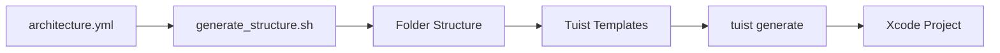

# 📱 Instagram Clone - SwiftUI + MVVM Architecture


A complete Instagram clone developed in SwiftUI using clean and scalable MVVM architecture. This project demonstrates best practices in modern iOS development, including automated project generation with Tuist and architecture management through YAML files.

---

## 📋 Table of Contents

- [Features](#-features)
- [Architecture](#-architecture)
- [Requirements](#-requirements)
- [Installation](#-installation)
- [Project Structure](#-project-structure)
- [Project Generation](#-project-generation)
- [YAML Configuration](#-yaml-configuration)
- [Tuist Templates](#-tuist-templates)
- [Usage](#-usage)
- [Roadmap](#-roadmap)
- [Contributing](#-contributing)
- [License](#-license)

---

## ✨ Features

- ✅ **Authentication** - User login and registration
- ✅ **Post Feed** - Infinite scroll with images and videos
- ✅ **Search & Explore** - Find users and content
- ✅ **Create Posts** - Capture photos or select from gallery
- ✅ **Stories** - 24-hour temporary content
- ✅ **Profiles** - View and edit user profiles
- ✅ **Notifications** - Real-time activity system
- ✅ **Likes & Comments** - Complete social interaction

---

## 🏗️ Architecture

### MVVM (Model-View-ViewModel)

This project implements a clean MVVM architecture with the following layers:

```
┌─────────────────────────────────────────┐
│            SwiftUI Views                │
│         (Presentation Layer)            │
└──────────────┬──────────────────────────┘
               │
               ▼
┌─────────────────────────────────────────┐
│           ViewModels                    │
│      (Business Logic Layer)             │
└──────────────┬──────────────────────────┘
               │
               ▼
┌─────────────────────────────────────────┐
│            Services                     │
│       (Data Access Layer)               │
└──────────────┬──────────────────────────┘
               │
               ▼
┌─────────────────────────────────────────┐
│        Models + Networking              │
│         (Data Layer)                    │
└─────────────────────────────────────────┘
```

### Design Principles

- **Separation of Concerns**: Each layer has clear responsibilities
- **Dependency Injection**: Facilitates testing and modularity
- **Coordinator Pattern**: Centralized navigation management
- **Protocol-Oriented**: Clear and testable interfaces
- **Reactive Programming**: Combine for reactive data flow

---

## 📦 Requirements

### Required Tools

| Tool | Version | Purpose |
|------|---------|---------|
| **Xcode** | 15.0+ | Development IDE |
| **Swift** | 5.9+ | Programming language |
| **Tuist** | 4.0+ | Project generation and management |
| **yq** | 4.0+ | YAML file processing |
| **Git** | 2.0+ | Version control |

### Dependency Installation

```bash
# Install Tuist
curl -Ls https://install.tuist.io | bash

# Install yq (macOS)
brew install yq

# Verify installations
tuist version
yq --version
```

---

## 🚀 Installation

### 1. Clone the Repository

```bash
git clone https://github.com/your-username/instagram-clone.git
cd instagram-clone
```

### 2. Configure Architecture

The project uses a YAML file to define the directory structure:

```bash
# The architecture.yml file defines the entire structure
cat architecture.yml
```

**Example `architecture.yml`:**

```yaml
project_name: InstagramClone

structure:
  - App:
      - InstagramCloneApp.swift
      - AppCoordinator.swift

  - Core:
      - Networking:
          - NetworkManager.swift
          - APIEndpoint.swift
          - HTTPMethod.swift
          - NetworkError.swift
      - Storage:
          - UserDefaultsManager.swift
          - KeychainManager.swift
          - PersistenceController.swift
      - Extensions:
          - View+Extensions.swift
          - Color+Extensions.swift
      - Utilities:
          - Constants.swift
          - ImageCache.swift

  - Models:
      - User.swift
      - Post.swift
      - Comment.swift
      - Story.swift

  - Features:
      - Authentication:
          - ViewModels:
              - LoginViewModel.swift
              - RegisterViewModel.swift
          - Views:
              - LoginView.swift
              - RegisterView.swift
          - AuthCoordinator.swift

      - Feed:
          - ViewModels:
              - FeedViewModel.swift
          - Views:
              - FeedView.swift
          - FeedCoordinator.swift

  - Services:
      - AuthenticationService.swift
      - PostService.swift
      - UserService.swift

  - Shared:
      - Components:
          - CustomButton.swift
          - CustomTextField.swift
      - Views:
          - LoadingView.swift
          - ErrorView.swift

  - Navigation:
      - Router.swift
      - NavigationState.swift

  - Resources:
      - Assets.xcassets:
      - Fonts:
```

### 3. Generate Folder Structure

Run the script that reads the YAML file and creates all directories:

```bash
# Grant execution permissions
chmod +x scripts/generate_structure.sh

# Generate structure from YAML
./scripts/generate_structure.sh architecture.yml
```

This script uses `yq` to parse the YAML and automatically create the entire hierarchy of folders and files.

### 4. Generate Project with Tuist

```bash
# Install Tuist dependencies (if any)
tuist install

# Generate Xcode project
tuist generate
```

### 5. Open in Xcode

```bash
open InstagramClone.xcworkspace
```

---

## 📁 Project Structure

```
InstagramClone/
├── App/                          # Application configuration
│   ├── InstagramCloneApp.swift   # Entry point
│   └── AppCoordinator.swift      # Main coordinator
│
├── Core/                         # Base functionality
│   ├── Networking/               # Network layer
│   ├── Storage/                  # Data persistence
│   ├── Extensions/               # Swift/SwiftUI extensions
│   └── Utilities/                # Helpers and utilities
│
├── Models/                       # Data models
│   ├── User.swift
│   ├── Post.swift
│   └── ...
│
├── Features/                     # Feature modules
│   ├── Authentication/
│   │   ├── ViewModels/
│   │   ├── Views/
│   │   └── AuthCoordinator.swift
│   ├── Feed/
│   ├── Search/
│   ├── Profile/
│   └── Stories/
│
├── Services/                     # Business services
│   ├── AuthenticationService.swift
│   ├── PostService.swift
│   └── ...
│
├── Shared/                       # Shared components
│   ├── Views/
│   ├── Components/
│   ├── Modifiers/
│   └── Protocols/
│
├── Navigation/                   # Navigation system
│   ├── Router.swift
│   └── NavigationState.swift
│
├── Resources/                    # Project resources
│   ├── Assets.xcassets/
│   └── Fonts/
│
├── Tuist/                        # Tuist configuration
│   ├── Config.swift
│   ├── Dependencies.swift
│   └── Templates/
│
├── scripts/                      # Automation scripts
│   └── generate_structure.sh
│
├── architecture.yml              # Architecture definition
├── Project.swift                 # Tuist project configuration
└── README.md
```

---

## 🔧 Project Generation

### Complete Workflow



### Detailed Step-by-Step

#### 1. **Define Architecture in YAML**

Create or modify `architecture.yml` with the desired structure:

```yaml
project_name: MyApp

structure:
  - MyModule:
      - ViewModels:
          - MyViewModel.swift
      - Views:
          - MyView.swift
```

#### 2. **Generate Structure with Script**

The `generate_structure.sh` script processes the YAML:

```bash
#!/bin/bash

# Script that uses yq to read YAML and create folders
YAML_FILE=$1

# Extract project name
PROJECT_NAME=$(yq '.project_name' $YAML_FILE)

# Create structure recursively
yq -r '.structure[] | to_entries[] | .key' $YAML_FILE | while read folder; do
    mkdir -p "$folder"
    echo "✓ Created: $folder"
done

echo "✅ Structure generated successfully"
```

Execute:
```bash
./scripts/generate_structure.sh architecture.yml
```

#### 3. **Configure Tuist**

**`Project.swift`:**

```swift
import ProjectDescription

let project = Project(
    name: "InstagramClone",
    targets: [
        Target(
            name: "InstagramClone",
            platform: .iOS,
            product: .app,
            bundleId: "com.yourapp.instagramclone",
            deploymentTarget: .iOS(targetVersion: "16.0", devices: [.iphone]),
            infoPlist: .default,
            sources: ["Sources/**"],
            resources: ["Resources/**"],
            dependencies: []
        )
    ]
)
```

#### 4. **Use Tuist Templates (Optional)**

```bash
# Create custom template
tuist edit

# Scaffold from template
tuist scaffold mvvm-feature --name Profile
```

#### 5. **Generate Project**

```bash
tuist generate
```

This will create:
- `InstagramClone.xcodeproj`
- `InstagramClone.xcworkspace`
- Scheme configurations

---

## ⚙️ YAML Configuration

### Syntax and Conventions

```yaml
project_name: ProjectName         # Project name

structure:
  - Folder:                       # Main folder
      - Subfolder:                # Subfolder
          - File.swift            # Swift file
      - OtherFile.swift           # File in main folder
  
  - AnotherFolder:
      - file.swift
```

### Complete Feature Example

```yaml
structure:
  - Features:
      - Profile:
          - ViewModels:
              - ProfileViewModel.swift
              - EditProfileViewModel.swift
          - Views:
              - ProfileView.swift
              - Components:
                  - ProfileHeaderView.swift
                  - ProfileStatsView.swift
          - ProfileCoordinator.swift
```

### YAML Approach Advantages

✅ **Declarative**: Defines structure clearly
✅ **Versionable**: Trackable changes in Git
✅ **Reproducible**: Same structure on any machine
✅ **Documentation**: Serves as project reference
✅ **Automatable**: Easy to process with scripts

---

## 🎨 Tuist Templates

### Template Structure

```
Tuist/Templates/
└── mvvm-feature/
    ├── mvvm-feature.swift        # Template definition
    └── Templates/
        ├── ViewModel.stencil     # ViewModel template
        ├── View.stencil          # View template
        └── Coordinator.stencil   # Coordinator template
```

### Template Example

**`mvvm-feature.swift`:**

```swift
import ProjectDescription

let nameAttribute: Template.Attribute = .required("name")

let template = Template(
    description: "MVVM Feature Template",
    attributes: [nameAttribute],
    items: [
        .file(
            path: "Features/\(nameAttribute)/ViewModels/\(nameAttribute)ViewModel.swift",
            templatePath: "ViewModel.stencil",
            context: ["fileName": "\(nameAttribute)ViewModel.swift"]
        ),
        .file(
            path: "Features/\(nameAttribute)/Views/\(nameAttribute)View.swift",
            templatePath: "View.stencil",
            context: ["fileName": "\(nameAttribute)View.swift"]
        )
    ]
)
```

**`ViewModel.stencil`:**

```swift
// {{ fileName }}
// {{ name }}
// Generated by Tuist

import Foundation
import Combine

final class {{ name }}ViewModel: ObservableObject {
    // MARK: - Published Properties
    @Published var isLoading = false
    @Published var error: Error?
    
    // MARK: - Initialization
    init() {
        // Setup
    }
    
    // MARK: - Methods
    func loadData() {
        // Implementation
    }
}
```

### Using Templates

```bash
tuist scaffold mvvm-feature --name Profile
```

---

## 💻 Usage

### Running the Application

```bash
# Open project
tuist generate
open InstagramClone.xcworkspace

# Or directly
tuist run
```

### Adding a New Feature

1. **Update `architecture.yml`:**

```yaml
  - Features:
      - NewFeature:
          - ViewModels:
              - NewFeatureViewModel.swift
          - Views:
              - NewFeatureView.swift
```

2. **Regenerate structure:**

```bash
./scripts/generate_structure.sh architecture.yml
```

3. **Implement code in created files**

### Testing

```bash
# Run tests
tuist test

# With coverage
tuist test --coverage
```

---

## 🗺️ Roadmap

- [ ] Firebase integration
- [ ] Direct messaging implementation
- [ ] Reels and short videos
- [ ] Real-time camera filters
- [ ] Custom dark mode
- [ ] Complete internationalization
- [ ] Unit tests (80%+ coverage)
- [ ] UI tests with Snapshot Testing
- [ ] CI/CD with GitHub Actions
- [ ] Complete documentation with DocC

---

## 🤝 Contributing

Contributions are welcome. Please:

1. Fork the project
2. Create a feature branch (`git checkout -b feature/AmazingFeature`)
3. Commit your changes (`git commit -m 'Add some AmazingFeature'`)
4. Push to the branch (`git push origin feature/AmazingFeature`)
5. Open a Pull Request

### Contribution Guidelines

- Follow the established MVVM architecture
- Update `architecture.yml` if adding new modules
- Include tests for new functionality
- Document public code with comments
- Use SwiftLint to maintain consistent style

---

## 📝 License

This project is licensed under the MIT License. See the `LICENSE` file for details.

---

## 👥 Authors

- **Your Name** - *Initial development* - [GitHub](https://github.com/your-username)

---

## 🙏 Acknowledgments

- Inspired by Instagram's architecture
- SwiftUI community
- Tuist development team
- yq contributors

---

## 📚 Additional Resources

- [SwiftUI Documentation](https://developer.apple.com/documentation/swiftui)
- [Tuist Documentation](https://docs.tuist.io)
- [MVVM Pattern in iOS](https://www.raywenderlich.com/34-design-patterns-by-tutorials-mvvm)
- [yq Documentation](https://mikefarah.gitbook.io/yq/)

---

**⭐ If you found this project helpful, consider giving it a star on GitHub!**